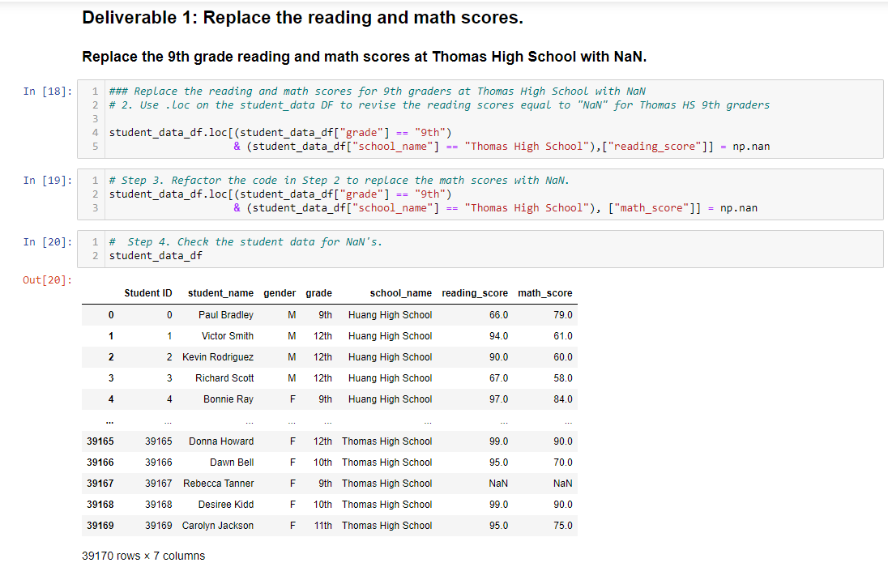

# School_District_Analysis
Overview of the school district analysis:
For this challenge we assisted Maria by analyzing student and school data. Through  this we can help inform the school district on school budgets and their priorities.
The school district wanted to break down the folling items:
* A high-level snapshot of the district's key metrics
* An overview of the key metrics for each school
* Visual aids, including tables depicting the following metrics:
  * Top 5 and bottom 5 performing schools, based on the overall passing rate
  * The average math score received by students in each grade level at each school
  * The average reading score received by students in each grade level at each school
  * School performance based on the budget per student
  * School performance based on the school size
  * School performance based on the type of school

Tools used:
* Anaconda
* Jupyter Notebook 
* Pandas
* Python

The purpose of this analysis is well defined (3 pt).
Results:
##Deliverable 1: Replace ninth-grade reading and math scores to NaN
The school district discovered that all standardized test scores for Thomas high School ninth grade students were altered and must be removed from the dataset. All other grades made by the other classes at Thomas High School were left intact.

We have filled the math and reading scores with "NaN". "NaN" represents "Not-a-Number" value. We have replced the scores with "NaN' for 461 student records. 

Although this may seem like a significant number, these score replacements did not alter data summaries tremendously overall.

##Deliverable 2: Repeat the school district analysis

There is a bulleted list that addresses how each of the seven school district metrics was affected by the changes in the data (10 pt).
Summary:

There is a statement summarizing four changes to the school district analysis after reading and math scores have been replaced (5 pt).
