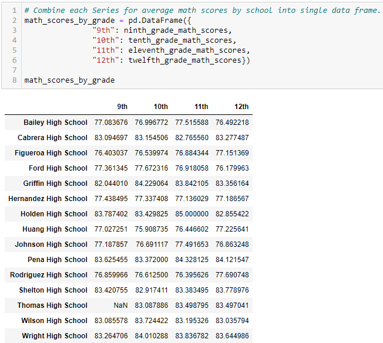

# School_District_Analysis
Overview of the school district analysis:

For this challenge we assisted Maria by analyzing student and school data. Through  this we can help inform the school district on school budgets and their priorities.
The school district wanted to break down the following items:
* A high-level snapshot of the district's key metrics
* An overview of the key metrics for each school
* Tables depicting the following metrics:
  * Top 5 and bottom 5 performing schools, based on the overall passing rate
  * The average math score received by students in each grade level at each school
  * The average reading score received by students in each grade level at each school
  * School performance based on the budget per student
  * School performance based on the school size
  * School performance based on the type of school

Tools used:
* Anaconda
* Jupyter Notebook 
* Pandas
* Python

Results:
## Deliverable 1: Replace ninth-grade reading and math scores to NaN
The school district discovered that all standardized test scores for Thomas high School ninth grade students were altered and must be removed from the dataset. All other grades made by the other classes at Thomas High School were left intact.

We have filled the ninth grade math and reading scores with "NaN". "NaN" represents "Not-a-Number" value. 

We can find the number of students removed by looking at our School Summary and taking the total of students at Thomas High School then subtracting the number of 10th-12th graders. 

This leaves us with a total of 461 9th grade students. Let's take a look at how this changes our School District Summary.

While 461 students may seem like a large number to remove but we can see by the examples above that the data did not shift the School Districts numbers that significantly. 
After the change the dataset shifted only about .1% for each catergory. 

## Deliverable 2: Repeat the school district analysis
**1. School Summary**

**2. Top Five and Bottom Five Schools Based on Overall Passing Rate**

**3. Average Math Scores by Grade and School**

**4. Average Reading Score by Grade and School**

**5. School performance based on the budget per student**

By removing the 9th graders scores, Thomas High Scool is in the $630-644 spending range.

**6. School performance based on the school size**

**7. School performance based on the type of school**

 

## Summary
Overall the changes to the 9th grade scores at Thomas High School had an affect 
