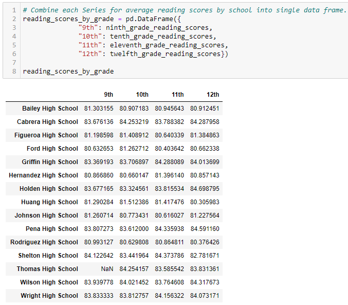

## Overview of the school district analysis:

For this challenge we assisted Maria by analyzing student and school data. Through this we can help inform the school district on school budgets and their priorities.
The school district wanted to break down the following items:
* A high-level snapshot of the district's key metrics
* An overview of the key metrics for each school
* Tables depicting the following metrics:
  * Top 5 and bottom 5 performing schools, based on the overall passing rate
  * The average math score received by students in each grade level at each school
  * The average reading score received by students in each grade level at each school
  * School performance based on the budget per student
  * School performance based on the school size
  * School performance based on the type of school

Tools used:
* Anaconda
* Jupyter Notebook 
* Pandas
* Python

## Deliverable 1: Replace ninth grade reading and math scores to NaN
The school district discovered that all standardized test scores for Thomas high School ninth grade students were altered and must be removed from the dataset. All other grades made by the other classes at Thomas High School were left intact.

We have filled the ninth grade math and reading scores with "NaN". "NaN" represents "Not-a-Number" value. 

We can find the number of students removed by looking at our School Summary and taking the total of students at Thomas High School then subtracting the number of 10th-12th graders. 

This leaves us with a total of 461 9th grade students. Let's look at how this changes our School District Summary.

While 461 students may seem like a large number to remove but we can see by the examples above that the data did not shift the School Districts numbers that significantly. 
After the change the dataset shifted only about .1% for each category. 

## Deliverable 2: Repeat the school district analysis
**1. School Summary**

Thomas high School is the only school affected. 

Percentages:
* Math moved from 93.2% to 66.9%, a 26.3% drop
* Reading moved from 97.3% to 69.66%, a 27.64% drop
* Overall Passing moved from 90.9% to 65.07%, a 25.83% drop

**2. Top Five and Bottom Five Schools Based on Overall Passing Rate**

With the removal of the 9th grade test scores at Thomas High School, the school drops out of the top 5 but remains out of the bottom 5. As seen in the new top five below. 

**3. Average Math Scores by Grade and School**

**4. Average Reading Score by Grade and School**

The Math and Reading scores are not as heavily affected since the dataset is by school and grade level. The other grades levels will remain unchanged. 

**5. School performance based on the budget per student**

While the impact didn't touch the average math scores or average reading scores. The overall passing percentages have been affected.
Changes to the Data:
* 6% decrease in overall % passing math
* 7% decrease in % passing reading
* 6% decrease in % overall passing 
By removing the 9th graders scores, Thomas High School is in the $630-644 spending range.

**6. School performance based on the school size**

The medium sized schools have been affected by this change. They have now dropped to 2nd in Overall % Passing. Previously the category held 91% overall passing but now displays as 85%. 

**7. School performance based on the type of school**

 

When comparing the differences in the numbers for School Performance based on School Types, the removal of the 9th grade scores resulted in a reduction in charter school's passing percentages. 
Before the change charter schools boasted a 94% passing math, 97% passing reading, 90% overall passing. After the removal, charter schools dropped to a 90% passing math, 93% passing reading, 87% overall passing. While charter schools experienced a drop in their percentages the numbers remain higher than district schools. 
## Summary
Overall, the changes to the 9th grade scores at Thomas High School did not distress the data too much but its effects were clear. 
